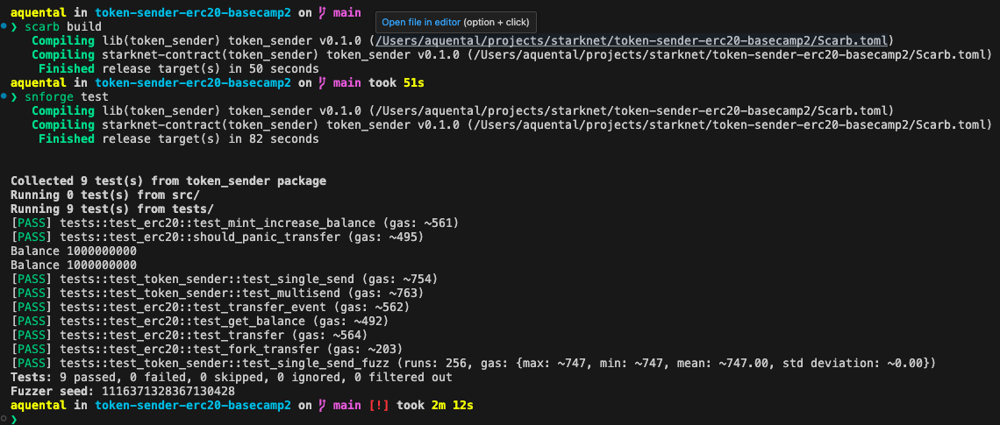

## setup

### scarb _2.6.4_ [docs](https://docs.swmansion.com/scarb/download.html)

```sh
curl --proto '=https' --tlsv1.2 -sSf https://docs.swmansion.com/scarb/install.sh | sh -s -- -v 2.6.4
```

### starknet-foundry _0.22.0_ [docs](https://foundry-rs.github.io/starknet-foundry/getting-started/installation.html)

```sh
curl -L https://raw.githubusercontent.com/foundry-rs/starknet-foundry/master/scripts/install.sh | sh
snfoundryup --version 0.22.0
```

### openzeppelin _0.10.0_

```text
[dependencies]
openzeppelin = { git = "https://github.com/openzeppelin/cairo-contracts", tag = "v0.10.0"}
```

---

```sh
scarb build
snforge test
```

[cheat sheet](./assets/cheatsheet.md)


