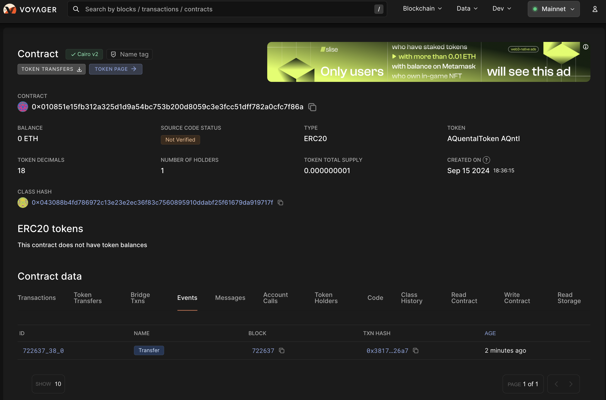

## 1 - criando pasta

```sh
mkdir ./wallets/mainnet

export WALLET="$PWD/wallets/mainnet"
export STARKNET_KEYSTORE="$WALLET/mainnet_keystore.json"

echo $WALLET
echo $STARKNET_KEYSTORE
```

# 1 - Key

## 1.1 - Conectando com a pvt local (mainnet)

```sh
starkli signer keystore from-key $STARKNET_KEYSTORE

Enter private key:
Enter password:
Created new encrypted keystore file: /Users/aquental/projects/starknet/token-sender-erc20-basecamp2/wallets/mainnet/mainnet_keystore.json
Public key: 0x002b091e333b5e8757a766ca1ce48a91472863955d01785d8f6beb971b424ef9
```

# 2 - [_Signers_](https://book.starkli.rs/signers)

## 2.1 - criando conta

```sh
starkli account oz init $WALLET/mainnet_account.json

Enter keystore password:
Created new account config file: /Users/aquental/projects/starknet/token-sender-erc20-basecamp2/wallets/mainnet/mainnet_account.json

Once deployed, this account will be available at:
    0x062d1be4a5bf3bc449ad7c2d16362e76229747fbca02033414e812780aa29a6a

Deploy this account by running:
    starkli account deploy /Users/aquental/projects/starknet/token-sender-erc20-basecamp2/wallets/mainnet/mainnet_account.json

export STARKNET_RPC="https://free-rpc.nethermind.io/mainnet-juno"

starkli account deploy $WALLET/mainnet_account.json

Enter keystore password:
The estimated account deployment fee is 0.000000097129177968 ETH. However, to avoid failure, fund at least:
    0.000000145693766952 ETH
to the following address:
    0x062d1be4a5bf3bc449ad7c2d16362e76229747fbca02033414e812780aa29a6a
Press [ENTER] once you've funded the address.
Account deployment transaction: 0x02180cd24547fa1b531e27d979ca7b33672283695012d34d32117eda3c30c588
Waiting for transaction 0x02180cd24547fa1b531e27d979ca7b33672283695012d34d32117eda3c30c588 to confirm. If this process is interrupted, you will need to run `starkli account fetch` to update the account file.
Transaction not confirmed yet...
Transaction 0x02180cd24547fa1b531e27d979ca7b33672283695012d34d32117eda3c30c588 confirmed

export ACC="0x062d1be4a5bf3bc449ad7c2d16362e76229747fbca02033414e812780aa29a6a"
```

## 2.2 - conectando com a conta local

```sh
export STARKNET_ACCOUNT="$WALLET/mainnet_account.json"

cat $STARKNET_ACCOUNT
echo $ACC

starkli account fetch $ACC --output $STARKNET_ACCOUNT

Account contract type identified as: OpenZeppelin
Description: OpenZeppelin account contract v0.13.0 compiled with cairo v2.6.3
Downloaded new account config file: /Users/aquental/projects/starknet/token-sender-erc20-basecamp2/wallets/erc20/usr_account.json
```

# 3 - Deploy

## 3.1 - declarando o token

### free RPC endpoint [services](https://www.starknet.io/fullnodes-rpc-services/)

|        Org | testnet                                     | mainnet                                     |
| ---------: | ------------------------------------------- | ------------------------------------------- |
|       Lava | https://rpc.starknet-testnet.lava.build:443 | https://rpc.starknet.lava.build:443         |
|      Blast | https://starknet-sepolia.public.blastapi.io | https://starknet-mainnet.public.blastapi.io |
| Nethermind | https://free-rpc.nethermind.io/sepolia-juno | https://free-rpc.nethermind.io/mainnet-juno |

```sh
export STARKNET_RPC="https://free-rpc.nethermind.io/mainnet-juno"

echo $STARKNET_KEYSTORE
echo $STARKNET_ACCOUNT
echo $STARKNET_RPC

starkli declare ./target/dev/token_sender_AQuentalToken.contract_class.json --account $STARKNET_ACCOUNT

Enter keystore password:
Sierra compiler version not specified. Attempting to automatically decide version to use...
Network detected: mainnet. Using the default compiler version for this network: 2.6.4. Use the --compiler-version flag to choose a different version.
Declaring Cairo 1 class: 0x043088b4fd786972c13e23e2ec36f83c7560895910ddabf25f61679da919717f
Compiling Sierra class to CASM with compiler version 2.6.4...
CASM class hash: 0x00789ba119feecf7bb2697e1910645846205f7c22d32600f499dddc3ad145b5c
Contract declaration transaction: 0x042875fc92ca2c42e8172efe67e8873e32fd18d18fa7321cce5e90b17ad58949
Class hash declared:
0x043088b4fd786972c13e23e2ec36f83c7560895910ddabf25f61679da919717f
```

## 3.2 - deploy [docs]()

```sh
starkli deploy 0x043088b4fd786972c13e23e2ec36f83c7560895910ddabf25f61679da919717f u256:1000000000 $ACC

Enter keystore password:
Deploying class 0x043088b4fd786972c13e23e2ec36f83c7560895910ddabf25f61679da919717f with salt 0x07604c70fba1041499bb54645e78fb7b27eb1c0eca969dfbe287c0ae8537ac56...
The contract will be deployed at address 0x010851e15fb312a325d1d9a54bc753b200d8059c3e3fcc51dff782a0cfc7f86a
Contract deployment transaction: 0x038174320f7f22c147ae4dce7075c786675293d1ab3b9a628ee6aff48c2e26a7
Contract deployed:
0x010851e15fb312a325d1d9a54bc753b200d8059c3e3fcc51dff782a0cfc7f86a
```

[mainnet contract](https://voyager.online/contract/0x010851e15fb312a325d1d9a54bc753b200d8059c3e3fcc51dff782a0cfc7f86a)


